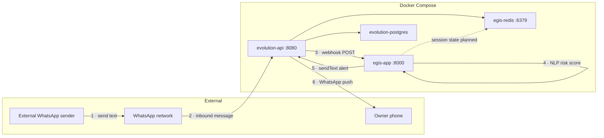

# Project Aegis — Architecture

Runtime architecture for the **local Docker Compose stack** and WhatsApp integration via Evolution API.

For the longer-term pipeline (Pub/Sub, Beam, BigQuery), see [`flow-diagram`](flow-diagram).

## Overview

Project Aegis analyzes **incoming WhatsApp text** for social-engineering / scam patterns. When the risk score reaches **8 or higher**, it sends a **WhatsApp alert** back to the configured owner number through Evolution API.

| Layer | Component | Port |
|-------|-----------|------|
| Gateway | `evolution-api` | 8080 |
| Inference | `egis-app` (FastAPI + spaCy) | 8000 |
| Cache | `egis-redis` | 6379 |
| Database | `evolution-postgres` | 5432 (internal) |

Start the stack:

```bash
cd docker
docker compose up --build
```

## Message flow (live)



### Step detail

1. **External sender** sends a WhatsApp message to the number linked in Evolution (`test-user` instance).
2. **Evolution API** receives the message (Baileys / WhatsApp Web).
3. **Webhook** — Evolution POSTs `messages.upsert` to `http://egis-app:8000/v1/webhook/whatsapp`.
4. **egis-app** runs spaCy NLP, computes a risk score, and sets flags (`URGENCY_DETECTED`, `AUTHORITY_CLAIMED`, `FINANCIAL_PIVOT`).
5. If **score ≥ 8**, egis-app calls Evolution `POST /message/sendText/{instance}`.
6. **Owner phone** receives the alert WhatsApp message.

Outbound messages from the linked phone (`fromMe: true`) are ignored to prevent feedback loops.

## Services (`docker/docker-compose.yml`)

### egis-app

- **Image:** built from `docker/dockerfile` (repo root context).
- **Endpoints:**
  - `POST /v1/webhook/whatsapp` — Evolution webhook ingestor
  - `POST /v1/analyze` — direct NLP API for testing
  - `GET /healthz` — liveness / readiness probe
- **Env (alerts):**
  - `EVOLUTION_API_URL` — `http://evolution-api:8080` inside Compose
  - `EVOLUTION_API_KEY` — matches Evolution `AUTHENTICATION_API_KEY`
  - `EVOLUTION_INSTANCE` — e.g. `test-user`
  - `EVOLUTION_ALERT_NUMBER` — e.g. `918117945755` (digits, no `+`)
  - `EVOLUTION_ALERTS_ENABLED` — `true` / `false`

### evolution-api

- **Image:** `evoapicloud/evolution-api:latest`
- **Webhook:** `WEBHOOK_GLOBAL_URL=http://egis-app:8000/v1/webhook/whatsapp`
- **Events:** `WEBHOOK_EVENTS_MESSAGES_UPSERT=true`
- Persists instances and metadata in PostgreSQL; uses Redis for cache.

### egis-redis

- Shared Redis for Evolution cache.
- Session / risk history for egis-app is **planned** (env vars exist; not fully wired in `app.py`).

### evolution-postgres

- Required for Evolution API v2.
- Database: `evolution_db`, schema: `evolution_api`.

## Risk scoring (summary)

| Signal | Detection | Points |
|--------|-----------|--------|
| Urgency | `now`, `immediately`, `urgent`, `minutes`, `seconds`, `last chance` | +2 per word |
| Authority | spaCy NER (`ORG`, `PERSON`, `GPE`) | +3 if any |
| Money / action | `transfer`, `pay`, `send`, `wire`, `buy`, `gift card`, `crypto` | +5 if any |

**Alert:** cumulative score **≥ 8**.

Example that triggers: `Wire transfer $500 immediately now urgent last chance`.

## What is scanned today

| Input | Status |
|-------|--------|
| Incoming WhatsApp **text** | Active |
| Image / PDF / voice (no extractable text) | Ignored (`non_text_message`) |
| Outbound from linked phone | Ignored (`fromMe`) |
| PDF / document pipeline | Not implemented in this repo |

## Testing

**Health:**

```bash
curl http://localhost:8000/healthz
curl -H "apikey: AegisSecretKey2026" http://localhost:8080/
```

**Instance status:**

```bash
curl -H "apikey: AegisSecretKey2026" \
  http://localhost:8080/instance/connectionState/test-user
```

**Simulate webhook (no WhatsApp):**

```bash
curl -X POST http://localhost:8000/v1/webhook/whatsapp \
  -H "Content-Type: application/json" \
  -d '{
    "event": "messages.upsert",
    "instance": "test-user",
    "data": {
      "key": { "remoteJid": "919999999999@s.whatsapp.net", "fromMe": false, "id": "t1" },
      "message": { "conversation": "Wire transfer immediately now urgent" }
    }
  }'
```

**Real WhatsApp test:** another phone sends a scam-like message to your linked number; watch `docker compose logs -f egis-app`.

## Future / not built

From [`flow-diagram`](flow-diagram):

- Message queue (Pub/Sub)
- Apache Beam stream processing
- Redis session history in the inference path
- BigQuery warehouse and model retraining
- Outbound alert routing beyond a single `sendText`

Optional integrations:

- **cyber-fraud-app** — Socket.IO chat + PDF scan (separate repo; not wired into this stack)
- **OpenShift** — `openshift/deployment.yaml` targets egis-app; Evolution and Postgres would be separate cluster deployments in production
