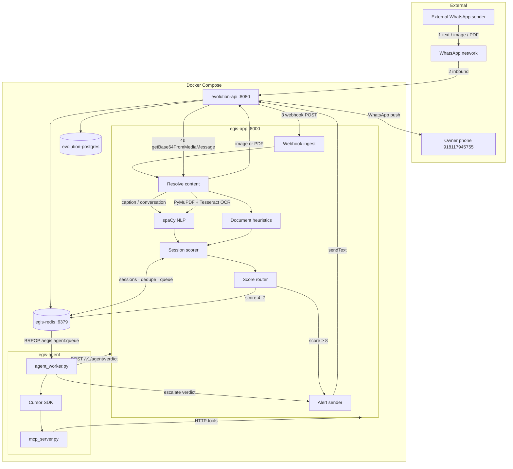

# Project Aegis — Architecture

Runtime architecture for the **local Docker Compose stack** and WhatsApp integration via Evolution API.

| Doc | Topic |
|-----|-------|
| [`MODULES.md`](MODULES.md) | Python module call flow |
| [`MCP.md`](MCP.md) | MCP tools for Cursor (Solution 2, dev/ops) |
| [`AGENT.md`](AGENT.md) | Gray-zone agent worker (Solution 3) |
| [`flow-diagram`](flow-diagram) | Long-term pipeline (Pub/Sub, Beam, BigQuery) |

## Overview

Project Aegis analyzes **incoming WhatsApp messages** — text, images, and PDFs — for social-engineering / scam patterns. Risk scores are **cumulative per conversation** (Redis).

| Score band | Action |
|------------|--------|
| **0–3** | Ignore (stored in session) |
| **4–7** | **Gray zone** → agent queue → Cursor agent triage |
| **≥ 8** | **Auto WhatsApp alert** to owner (rule engine, no agent) |

| Layer | Component | Port |
|-------|-----------|------|
| Gateway | `evolution-api` | 8080 |
| Inference | `egis-app` (FastAPI + spaCy + OCR) | 8000 |
| Agent worker | `egis-agent` (Cursor SDK + MCP) | — |
| Session store | `egis-redis` | 6379 |
| Database | `evolution-postgres` | 5432 (internal) |

Start the full stack (including agent):

```bash
cd docker
docker compose up --build
```

Requires `CURSOR_API_KEY` in project-root `.env` for `egis-agent`.

---

## Three solutions (coexist)

```text
Solution 1 (automatic — always on):
  WhatsApp → Evolution → egis-app webhook → spaCy + heuristics → Redis → alert if ≥ 8

Solution 2 (optional — dev/ops in Cursor):
  You / Cursor chat → MCP tools → HTTP to egis-app (no webhook changes)

Solution 3 (automatic gray zone — egis-agent container):
  egis-app enqueues score 4–7 → Redis List → egis-agent → Cursor SDK + MCP → verdict → maybe alert
```

Solution 1 is unchanged when Solutions 2–3 are enabled. The webhook never calls an LLM directly.

---

## Message flow (live)



### Step detail

1. **External sender** sends text, image, or PDF to the linked WhatsApp number (`test-user` instance).
2. **Evolution API** receives the message (Baileys / WhatsApp Web).
3. **Webhook** — Evolution POSTs `messages.upsert` to `http://egis-app:8000/v1/webhook/whatsapp`.
4. **Content resolution** inside `egis-app`:
   - Plain text / captions from the webhook payload
   - For `imageMessage` / `documentMessage` → `POST /chat/getBase64FromMediaMessage/{instance}`
   - PDF: PyMuPDF text extraction + Tesseract OCR on thin pages
   - Images: Tesseract OCR
5. **Analysis** — spaCy NLP + PDF document heuristics (`document_heuristics.py`).
6. **Redis session** — load cumulative `risk_score`, `flags`, and `message_history` per `remoteJid`; add message delta; dedupe by `message_id`.
7. **Score routing:**
   - **≥ 8** → Evolution `sendText` alert (if cooldown allows). `agent_queued: false`.
   - **4–7** → `LPUSH` job to `aegis:agent:queue`. `egis-agent` reviews via Cursor SDK + MCP.
   - **0–3** → no alert, no agent.
8. **Agent verdict** (`escalate` / `benign` / `monitor`) applied via `POST /v1/agent/verdict`; `escalate` may trigger alert.
9. **Owner phone** receives WhatsApp warnings when rules or agent escalate.

Outbound messages from the linked phone (`fromMe: true`) are ignored.

---

## Modules

### egis-app (inference)

| Module | Responsibility |
|--------|----------------|
| `app.py` | FastAPI routes, webhook orchestration, scoring, agent enqueue |
| `session_store.py` | Redis sessions, dedupe, cooldown, agent queue, cases |
| `agent_config.py` | Gray-zone settings shared with agent worker |
| `evolution_client.py` | Fetch media base64 from Evolution API |
| `media_extractor.py` | PDF parse, image OCR (PyMuPDF + Tesseract) |
| `document_heuristics.py` | Fake-official PDF pattern detection |

### egis-agent (gray-zone worker)

| Module | Responsibility |
|--------|----------------|
| `agent_worker.py` | `BRPOP` queue, Cursor SDK agent loop, submit verdict |
| `mcp_server.py` | MCP tools → HTTP to `egis-app` (spawned by SDK) |
| `agent_config.py` | Shared env, MCP stdio config |

`mcp_server.py` does **not** import `app.py`. It only calls HTTP APIs.

### MCP in Cursor (optional, local Mac)

Same `mcp_server.py` can run in Cursor IDE for manual inspection. See [`MCP.md`](MCP.md).

---

## API endpoints

### Core (Solution 1)

| Method | Path | Purpose |
|--------|------|---------|
| `POST` | `/v1/webhook/whatsapp` | Evolution webhook ingestor |
| `POST` | `/v1/analyze` | Direct NLP API (no Redis write) |
| `POST` | `/v1/scan-document` | Upload PDF/image for local testing |
| `GET` | `/healthz` | Health probe |

### Session read (ops / MCP)

| Method | Path | Purpose |
|--------|------|---------|
| `GET` | `/v1/session/{conversation_id}` | Read Redis session |
| `GET` | `/v1/sessions` | List sessions by min risk |

### Agent (Solution 3)

| Method | Path | Purpose |
|--------|------|---------|
| `GET` | `/v1/agent/status` | Queue depth, gray-zone config |
| `POST` | `/v1/agent/verdict` | Worker applies verdict |
| `GET` | `/v1/agent/case/{job_id}` | Read agent case outcome |

---

## Redis keys (`egis-redis`)

| Key pattern | Type | Purpose |
|-------------|------|---------|
| `aegis:session:{remoteJid}` | String (JSON) | Cumulative session state |
| `aegis:msg:{messageId}` | String | Message dedupe |
| `aegis:alert_cooldown:{remoteJid}` | String (TTL) | Alert rate limit per sender |
| `aegis:agent:queue` | **List** | Gray-zone job queue (`LPUSH` / `BRPOP`) |
| `aegis:agent:pending:{remoteJid}` | String (TTL) | Dedupe agent enqueue per sender |
| `aegis:agent:case:{job_id}` | String (TTL) | Stored agent verdict |

**Note:** The agent queue is a simple Redis List, not Redis Streams or RabbitMQ. Sufficient for a single `egis-agent` worker; upgrade path is Redis Streams or RabbitMQ for multi-worker durability.

Evolution API also uses this Redis instance for its cache (`CACHE_REDIS_URI`).

---

## Services (`docker/docker-compose.yml`)

| Service | Container | Role |
|---------|-----------|------|
| `egis-app` | `egis-inference-engine` | Webhook, NLP, scoring, enqueue |
| `egis-agent` | `egis-agent-worker` | Gray-zone Cursor agent (`restart: unless-stopped`) |
| `evolution-api` | `evolution-api-gateway` | WhatsApp gateway + webhooks |
| `egis-redis` | `egis-state-cache` | Sessions + agent queue + Evolution cache |
| `evolution-postgres` | `evolution-postgres` | Evolution v2 DB |

### egis-app

Built from `docker/dockerfile` — Tesseract, PyMuPDF, spaCy, Redis client.

### egis-agent

Built from `docker/agent.dockerfile` — Python 3.12, `cursor-sdk`, MCP, Redis client.

- Reads `CURSOR_API_KEY` from `../.env`
- `EGIS_API_URL=http://egis-app:8000` (internal Docker network)
- `REDIS_HOST=egis-redis`

### evolution-api

- Image: `evoapicloud/evolution-api:latest`
- Webhook: `WEBHOOK_GLOBAL_URL=http://egis-app:8000/v1/webhook/whatsapp`
- Media: `POST /chat/getBase64FromMediaMessage/{instance}`

---

## Key environment variables

### egis-app

| Variable | Default | Purpose |
|----------|---------|---------|
| `RISK_ALERT_THRESHOLD` | `8` | Auto-alert threshold |
| `GRAY_ZONE_MIN` | `4` | Agent enqueue lower bound |
| `GRAY_ZONE_MAX` | `7` | Agent enqueue upper bound |
| `AGENT_ENABLED` | `true` | Enable gray-zone queue |
| `EVOLUTION_ALERT_NUMBER` | — | Alert recipient (digits) |
| `ALERT_COOLDOWN_SECONDS` | `300` | Min gap between alerts per sender |
| `REDIS_SESSION_TTL_SECONDS` | `604800` | Session TTL (7 days) |

### egis-agent

| Variable | Purpose |
|----------|---------|
| `CURSOR_API_KEY` | Cursor SDK auth (from `.env`) |
| `CURSOR_AGENT_MODEL` | Default `composer-2.5` |
| `AGENT_INTERNAL_TOKEN` | Optional secret for `/v1/agent/verdict` |

---

## Risk scoring (summary)

Scores are **cumulative** per conversation (stored in Redis).

| Signal | Detection | Points |
|--------|-----------|--------|
| Urgency | `now`, `immediately`, `urgent`, `minutes`, `seconds`, `last chance` | +2 per word |
| Authority | spaCy NER (`ORG`, `PERSON`, `GPE`) | +3 if any |
| Money / action | `transfer`, `pay`, `send`, `wire`, `buy`, `gift card`, `crypto` | +5 if any |
| Document heuristics | Fake official PDF patterns | +3 per trigger (max +9) |

**Routing after each message:**

| Cumulative score | Outcome |
|------------------|---------|
| 0–3 | Stored, no action |
| 4–7 | Queued for `egis-agent` |
| ≥ 8 | Immediate WhatsApp alert |

**Example multi-message scam:** message 1 benign → message 2 “wire transfer” (+5) → message 3 “urgent now” (+6) → cumulative 11 → auto-alert (no agent).

---

## What is scanned today

| Input | Status |
|-------|--------|
| Incoming WhatsApp **text** | Active |
| WhatsApp **image** (OCR) | Active |
| WhatsApp **PDF** (text + OCR + heuristics) | Active |
| Image/PDF **caption** | Merged with extracted text |
| Video / audio / stickers (no text) | Ignored or `media_extract_failed` |
| Outbound from linked phone | Ignored (`fromMe`) |

---

## Testing

### Health

```bash
curl http://localhost:8000/healthz
curl http://localhost:8000/v1/agent/status
```

### Solution 1 — auto-alert (no agent)

```bash
curl -X POST http://localhost:8000/v1/webhook/whatsapp \
  -H "Content-Type: application/json" \
  -d '{
    "event": "messages.upsert",
    "instance": "test-user",
    "data": {
      "key": { "remoteJid": "919111222333@s.whatsapp.net", "fromMe": false, "id": "rules-1" },
      "message": { "conversation": "Wire transfer $500 immediately now urgent" }
    }
  }'
```

Expect: `"alert": true`, `"agent_queued": false`, `"alert_delivery": { "alert_sent": true }`.

### Solution 3 — gray-zone agent

```bash
curl -X POST http://localhost:8000/v1/webhook/whatsapp \
  -H "Content-Type: application/json" \
  -d '{
    "event": "messages.upsert",
    "instance": "test-user",
    "data": {
      "key": { "remoteJid": "919444555666@s.whatsapp.net", "fromMe": false, "id": "gray-1" },
      "message": { "conversation": "Please send payment soon it is urgent" }
    }
  }'
```

Expect: `"alert": false`, `"agent_queued": true`, `"cumulative_risk": 7`.

Then:

```bash
docker compose logs -f egis-agent
curl http://localhost:8000/v1/agent/case/gray-1
```

### Inspect Redis

```bash
docker exec egis-state-cache redis-cli GET "aegis:session:919444555666@s.whatsapp.net"
docker exec egis-state-cache redis-cli LLEN aegis:agent:queue
```

### Upload PDF/image (no WhatsApp)

```bash
curl -X POST http://localhost:8000/v1/scan-document \
  -F "file=@/path/to/notice.pdf"
```

---

## Future / not built

From [`flow-diagram`](flow-diagram):

- Async message queue (Pub/Sub) — agent uses Redis List today; OCR still inline in webhook
- Apache Beam stream processing
- BigQuery warehouse and model retraining
- Redis Streams or RabbitMQ for durable multi-worker agent queue

Optional:

- **cyber-fraud-app** — separate demo chat; heuristics partially ported into `document_heuristics.py`
- **OpenShift** — `openshift/deployment.yaml` targets egis-app; Redis/Evolution are separate cluster services in production
