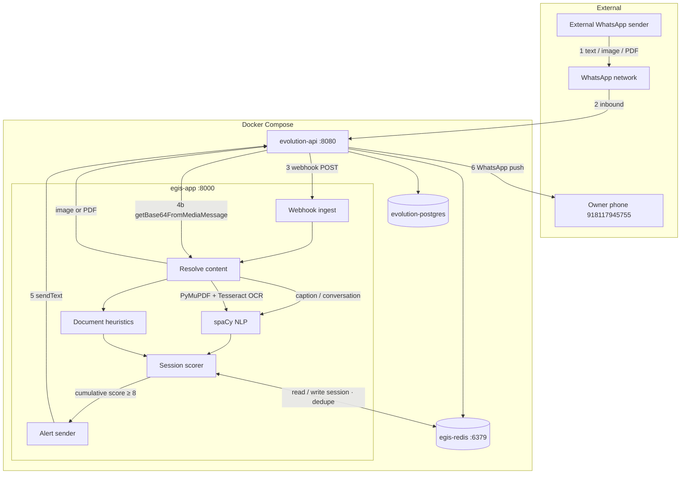

# Project Aegis — Architecture

Runtime architecture for the **local Docker Compose stack** and WhatsApp integration via Evolution API.

For the longer-term pipeline (Pub/Sub, Beam, BigQuery), see [`flow-diagram`](flow-diagram).

## Overview

Project Aegis analyzes **incoming WhatsApp messages** — text, images, and PDFs — for social-engineering / scam patterns. Risk scores are **cumulative per conversation** (Redis). When the score reaches **8 or higher**, a **WhatsApp alert** is sent to the owner number via Evolution API.

| Layer | Component | Port |
|-------|-----------|------|
| Gateway | `evolution-api` | 8080 |
| Inference | `egis-app` (FastAPI + spaCy + OCR) | 8000 |
| Session store | `egis-redis` | 6379 |
| Database | `evolution-postgres` | 5432 (internal) |

Start the stack:

```bash
cd docker
docker compose up --build
```

## Message flow (live)



### Step detail

1. **External sender** sends text, image, or PDF to the linked WhatsApp number (`test-user` instance).
2. **Evolution API** receives the message (Baileys / WhatsApp Web).
3. **Webhook** — Evolution POSTs `messages.upsert` to `http://egis-app:8000/v1/webhook/whatsapp`.
4. **Content resolution** inside `egis-app`:
   - Plain text / captions from the webhook payload
   - For `imageMessage` / `documentMessage` → `POST /chat/getBase64FromMediaMessage/{instance}`
   - PDF: PyMuPDF text extraction + Tesseract OCR on thin pages
   - Images: Tesseract OCR
5. **Analysis** — spaCy NLP + PDF document heuristics (`document_heuristics.py`, ported from cyber-fraud-app).
6. **Redis session** — load cumulative `risk_score` and `flags` per `remoteJid`; add message delta; dedupe by `message_id`; alert cooldown per sender.
7. If **cumulative score ≥ 8** and cooldown allows → Evolution `sendText` alert.
8. **Owner phone** receives the WhatsApp warning.

Outbound messages from the linked phone (`fromMe: true`) are ignored.

## egis-app modules

| Module | Responsibility |
|--------|----------------|
| `app.py` | FastAPI routes, webhook orchestration, scoring glue |
| `session_store.py` | Redis sessions, message dedupe, alert cooldown |
| `evolution_client.py` | Fetch media base64 from Evolution API |
| `media_extractor.py` | PDF parse, image OCR (PyMuPDF + Tesseract) |
| `document_heuristics.py` | Fake-official PDF pattern detection |

### API endpoints

| Method | Path | Purpose |
|--------|------|---------|
| `POST` | `/v1/webhook/whatsapp` | Evolution webhook ingestor |
| `POST` | `/v1/analyze` | Direct NLP API (client-provided session) |
| `POST` | `/v1/scan-document` | Upload PDF/image for local testing |
| `GET` | `/healthz` | Health probe (`redis_connected`, model loaded) |

### Key environment variables

| Variable | Purpose |
|----------|---------|
| `EVOLUTION_API_URL` | `http://evolution-api:8080` (internal) |
| `EVOLUTION_API_KEY` | Evolution auth key |
| `EVOLUTION_INSTANCE` | e.g. `test-user` |
| `EVOLUTION_ALERT_NUMBER` | Alert recipient (digits, no `+`) |
| `REDIS_HOST` / `REDIS_PORT` | Session store |
| `REDIS_SESSION_TTL_SECONDS` | Conversation TTL (default 7 days) |
| `ALERT_COOLDOWN_SECONDS` | Min gap between alerts per sender (default 300) |
| `RISK_ALERT_THRESHOLD` | Default `8` |
| `MAX_MEDIA_BYTES` | Max download size (default 8 MB) |

## Services (`docker/docker-compose.yml`)

### egis-app

Built from `docker/dockerfile` with **Tesseract**, **PyMuPDF**, **spaCy**, **Redis client**.

### evolution-api

- Image: `evoapicloud/evolution-api:latest`
- Webhook: `WEBHOOK_GLOBAL_URL=http://egis-app:8000/v1/webhook/whatsapp`
- Media API used by egis: `POST /chat/getBase64FromMediaMessage/{instance}`

### egis-redis

- Evolution API cache (`CACHE_REDIS_URI`)
- **Aegis conversation sessions** (`aegis:session:{remoteJid}`)
- Message dedupe keys (`aegis:msg:{messageId}`)
- Alert cooldown keys (`aegis:alert_cooldown:{remoteJid}`)

### evolution-postgres

Evolution API v2 persistence (`evolution_db`).

## Risk scoring (summary)

Scores are **cumulative** per conversation (stored in Redis).

| Signal | Detection | Points |
|--------|-----------|--------|
| Urgency | `now`, `immediately`, `urgent`, `minutes`, `seconds`, `last chance` | +2 per word |
| Authority | spaCy NER (`ORG`, `PERSON`, `GPE`) | +3 if any |
| Money / action | `transfer`, `pay`, `send`, `wire`, `buy`, `gift card`, `crypto` | +5 if any |
| Document heuristics | Fake official PDF patterns (govt + payment, metadata, filename) | +3 per trigger (max +9) |

**Alert:** cumulative score **≥ 8** (configurable).

**Example multi-message scam:** message 1 benign → message 2 “wire transfer” (+5) → message 3 “urgent now” (+6) → cumulative 11 → alert.

## What is scanned today

| Input | Status |
|-------|--------|
| Incoming WhatsApp **text** | Active |
| WhatsApp **image** (OCR) | Active |
| WhatsApp **PDF** (text + OCR + heuristics) | Active |
| Image/PDF **caption** | Merged with extracted text |
| Video / audio / stickers (no text) | Ignored or `media_extract_failed` |
| Outbound from linked phone | Ignored (`fromMe`) |

## Testing

**Health:**

```bash
curl http://localhost:8000/healthz
```

**Upload PDF/image (no WhatsApp):**

```bash
curl -X POST http://localhost:8000/v1/scan-document \
  -F "file=@/path/to/notice.pdf"
```

**Simulate text webhook:**

```bash
curl -X POST http://localhost:8000/v1/webhook/whatsapp \
  -H "Content-Type: application/json" \
  -d '{
    "event": "messages.upsert",
    "instance": "test-user",
    "data": {
      "key": { "remoteJid": "919999999999@s.whatsapp.net", "fromMe": false, "id": "t1" },
      "message": { "conversation": "Wire transfer immediately now urgent" }
    }
  }'
```

**Cumulative session test:** send multiple webhooks with the same `remoteJid` and different `id` values; watch `previous_risk` and `cumulative_risk` increase.

**Inspect Redis session:**

```bash
docker exec egis-state-cache redis-cli GET "aegis:session:919999999999@s.whatsapp.net"
```

**Real WhatsApp:** send text, PDF, or image from another phone; watch `docker compose logs -f egis-app`.

## Future / not built

From [`flow-diagram`](flow-diagram):

- Async message queue (Pub/Sub) — OCR still runs inline in webhook today
- Apache Beam stream processing
- BigQuery warehouse and model retraining
- MCP tool layer / agentic triage
- Selective LLM pass for gray-zone messages

Optional:

- **cyber-fraud-app** — separate demo chat; heuristics partially ported into `document_heuristics.py`
- **OpenShift** — `openshift/deployment.yaml` targets egis-app; Redis/Evolution are separate cluster services in production
