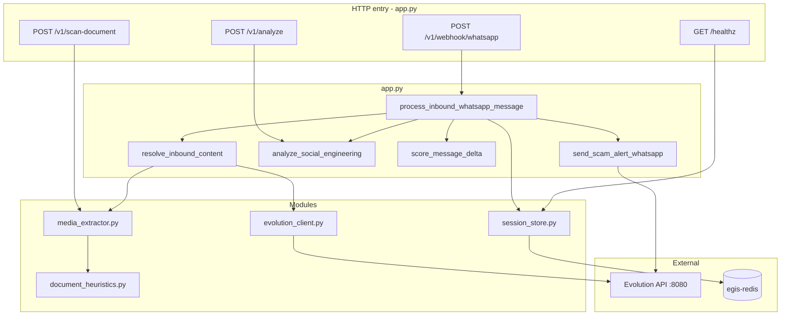

# Project Aegis — Python modules

How the `.py` files connect in the **live Docker stack** (`uvicorn app:app`).

For deployment topology, see [`ARCHITECTURE.md`](ARCHITECTURE.md). For the long-term pipeline, see [`flow-diagram`](flow-diagram).

## Import graph

Only `app.py` is the HTTP entry point. Other runtime modules are imported from there.

```
app.py
 ├── session_store.py
 ├── evolution_client.py
 └── media_extractor.py
      └── document_heuristics.py
```

| File | Imports | Called by |
|------|---------|-----------|
| `app.py` | `session_store`, `evolution_client`, `media_extractor` | Docker / uvicorn |
| `session_store.py` | `redis` | `app.py` |
| `evolution_client.py` | `httpx` | `app.py` |
| `media_extractor.py` | `document_heuristics` | `app.py` |
| `document_heuristics.py` | `re` | `media_extractor.py` only |

`document_heuristics.py` never imports or calls `app.py`.

## Call flow diagram



## Path 1: WhatsApp webhook (production path)

```
POST /v1/webhook/whatsapp
  └── handle_whatsapp_webhook()          [app.py]
        └── process_inbound_whatsapp_message(record, instance)
```

Inside `process_inbound_whatsapp_message`:

| Step | Function | Module |
|------|----------|--------|
| 1 | `mark_message_if_new(message_id)` | `session_store.py` |
| 2 | `resolve_inbound_content(record, instance)` | `app.py` |
| 2a | `extract_whatsapp_text(message)` | `app.py` |
| 2b | `fetch_message_media(instance, record)` | `evolution_client.py` |
| 2c | `extract_text_from_media_async(bytes, …)` | `media_extractor.py` |
| 2d | `analyze_document_signals(…)` | `document_heuristics.py` (PDF only) |
| 3 | `analyze_social_engineering(text)` | `app.py` |
| 4 | `score_message_delta(analysis, doc_delta, …)` | `app.py` |
| 5 | `get_session(sender_id)` | `session_store.py` |
| 6 | `save_session(session)` | `session_store.py` |
| 7 | `try_acquire_alert_cooldown(sender)` | `session_store.py` |
| 8 | `send_scam_alert_whatsapp(…)` | `app.py` → Evolution HTTP |

Steps 2b–2c run only when the message contains `imageMessage` or `documentMessage`.

## Path 2: Upload scan (local test, no WhatsApp)

```
POST /v1/scan-document
  └── scan_document_upload()             [app.py]
        ├── extract_text_from_media_async()
        ├── analyze_social_engineering()
        └── score_message_delta()
```

Does **not** use `evolution_client` or `session_store`.

## Path 3: Direct analyze API

```
POST /v1/analyze
  └── evaluate_message_stream()          [app.py]
        ├── analyze_social_engineering()
        └── score_message_delta()
```

Client supplies optional `session_state` in JSON. Redis is **not** read or written.

## Path 4: Startup and health

```
App lifespan start  →  session_store.connect()
App lifespan stop   →  session_store.disconnect()

GET /healthz        →  session_store.ping()
```

## Module responsibilities

### `app.py`

- FastAPI routes and request handling
- spaCy NLP (`analyze_social_engineering`)
- Scoring (`score_message_delta`, `RISK_ALERT_THRESHOLD`)
- Webhook payload parsing (`extract_whatsapp_text`, `evolution_message_records`)
- Outbound alerts (`send_scam_alert_whatsapp` via httpx)

### `session_store.py`

Redis keys:

| Key | Purpose |
|-----|---------|
| `aegis:session:{remoteJid}` | Cumulative `risk_score`, `flags`, `message_count` |
| `aegis:msg:{messageId}` | Webhook deduplication |
| `aegis:alert_cooldown:{remoteJid}` | Limit repeat WhatsApp alerts |

### `evolution_client.py`

- `fetch_message_media()` → `POST /chat/getBase64FromMediaMessage/{instance}`
- Returns raw bytes + mimetype for PDF/image processing

### `media_extractor.py`

- PDF: PyMuPDF text extraction; Tesseract OCR on thin pages
- Images: Tesseract OCR
- Delegates PDF scam patterns to `document_heuristics.py`

### `document_heuristics.py`

- Regex heuristics for fake official documents (govt + payment, metadata, filename)
- Returns `document_delta`, `document_flags`, `document_triggers`

## Standalone scripts (not in Docker image flow)

These files are **not** imported by `app.py`:

| File | Purpose |
|------|---------|
| `feature-extractor.py` | Early spaCy demo |
| `feature-extractor-session.py` | Session experiment |
| `evaluator.py` | Batch evaluation on `dataset.json` |
| `app-bkp.py` | Backup of older `app.py` |

## Docker copy list

`docker/dockerfile` copies into the image:

```
app.py
session_store.py
evolution_client.py
media_extractor.py
document_heuristics.py
```
